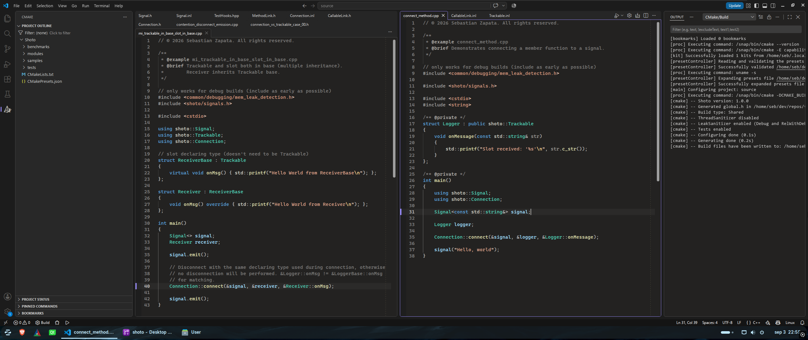

# Visual Studio 2026-inspired UX for VS Code (Work in progress, do NOT use yet)

A rather niche VS Code customization for C++ developers. I’ve used Visual
Studio for many years and currently use Visual Studio 2026, but I also have to
do a lot of development directly on Linux systems. VS Code seems like the best
option there, so I’ve created not only a theme, but also several UX
modifications that match the behavior of Visual Studio 2026. This reduces the
visual and behavioral readjustment required every time I switch IDEs, saving
me time and mental energy.

I’m not trying to create an exact clone. The goal is simply to make it feel
subconsciously familiar, reducing the cognitive effort required to quickly
identify UI elements and adapt to behaviors that differ significantly from
Visual Studio.

## Features

* Visual Studio 2026-inspired editor and workbench colors
* Dotted indentation guides
* Customized tab appearance and behavior
* Customized scrolling and scrollbar behavior
* Matching UI spacing, borders, and visual details
* Font-rendering adjustments
* C++ syntax-color customizations

The customization consists of VS Code settings together with custom CSS and
JavaScript loaded through
[Custom CSS and JS Loader](https://marketplace.visualstudio.com/items?itemName=be5invis.vscode-custom-css).

## Disclaimer

This is an independent project and is not affiliated with, sponsored by, or
endorsed by Microsoft.

Visual Studio, Visual Studio Code, and Microsoft are trademarks of Microsoft
Corporation.

## License

Licensed under the [MIT License](LICENSE).

Copyright © 2026 Sebastian Zapata.
